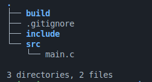

c (v0.0.2)

A build tool for c (like cargo for rust).

(for linux!)

## Status

### Working commands:

version - prints this tools version.

init - creates a new c project in current directory.

run - builds and runs the project (you can pass cli args after run with a space).

## Dependencies

- os: linux

- shell: bash

- compiler: gcc

## Building the project

- Clone the repo.

- Inside project folder that you cloned, run:

  `mkdir build`

- then:

  `gcc -Wall -Wextra $(find src -name '*.c') -o build/c`

- The binary will be created in build/ directory.

- After that, just place the output binary where you like and add it to the PATH environment variable.

## Usage

- Print Version:

  `c version`

- New project in current directory:

  `c init`

- Build and run the project:

  `c run`

  To pass cli args:

  `c run hello world`

## Generated project structure by init command

### Suppose your project folder is 'hello':

Here:

1. src folder - for all c src files (you can nest them in sub-folders).
2. include folder - for all header files.
3. lib folder - for all source libraries that are created using c tool.
4. build folder - where the output binary will go.
5. .gitignore - for excluding the build folder from git history.

## License

MIT
